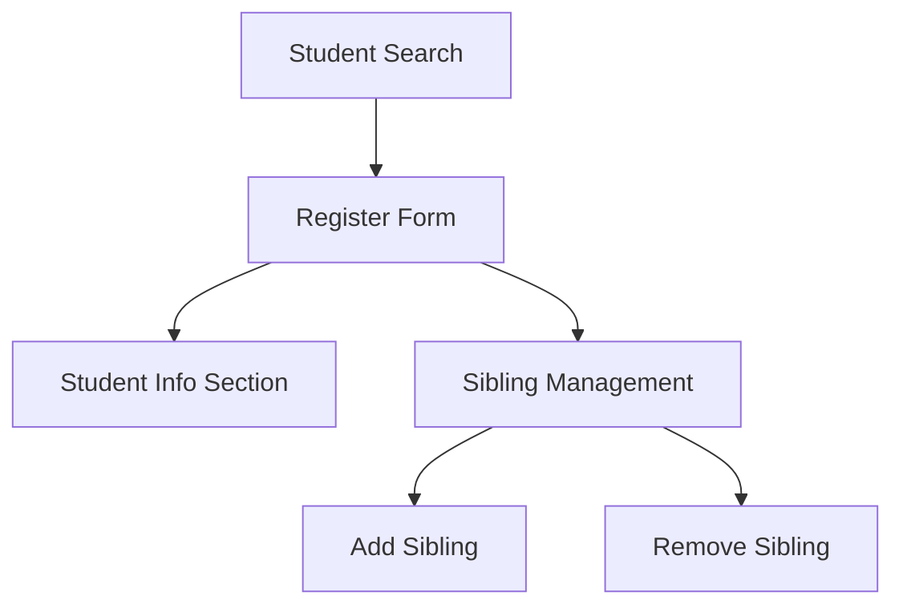
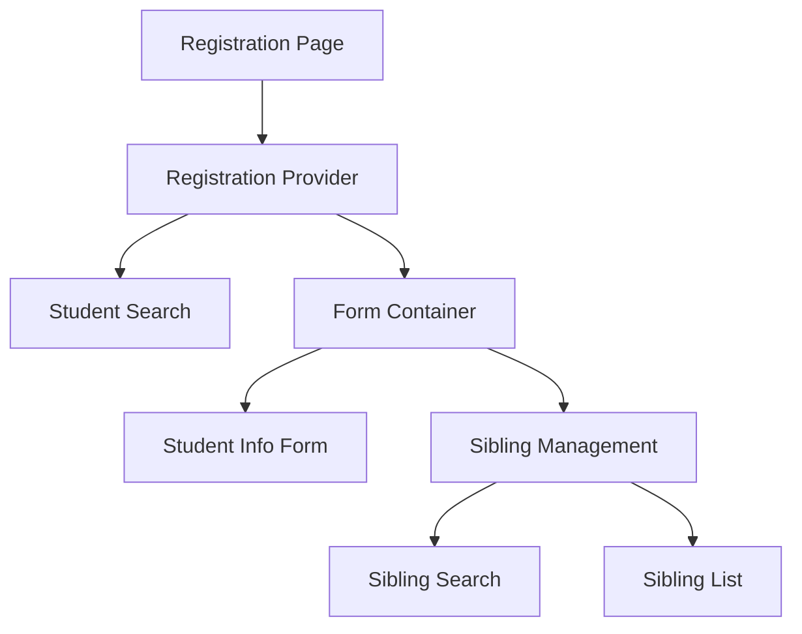

# Student Registration System Design

## Current State Analysis

### Overview

The current registration system allows students to update their information and manage sibling relationships. However, it faces several challenges with state management and user experience.

### Current Architecture

#### Components

- `RegisterForm`: Main form component for student information
- `SiblingManagement`: Handles sibling relationships
- `StudentSearch`: Combobox for finding students

#### Data Flow



### Current Challenges

1. **State Management Issues**

   - Form state resets unexpectedly
   - Sibling management state conflicts with form state
   - Confirmation dialogs don't persist state properly
   - Unsaved changes aren't tracked consistently

2. **User Experience Problems**

   - Multiple save buttons create confusion
   - No clear indication of form progress
   - Validation feedback is inconsistent
   - Success/error messages don't provide enough context

3. **Technical Debt**
   - Prop drilling across components
   - Complex state logic spread across components
   - Inconsistent error handling
   - Limited type safety

## Proposed Solution

### Core Principles

1. **Single Source of Truth**

   - Centralized state management with Zustand
   - Clear state updates and transitions
   - Predictable data flow

2. **Enhanced User Experience**

   - Single save button for all changes
   - Clear progress indicators
   - Consistent validation feedback
   - Intuitive sibling management

3. **Robust Architecture**
   - Type-safe state management
   - Centralized error handling
   - Clear separation of concerns
   - Testable components

### State Management

#### Zustand Store Structure

```typescript
interface RegistrationStore {
  // Student Data
  selectedStudent: Student | null
  studentInfo: StudentFormData
  siblingGroup: SiblingGroup | null

  // UI State
  isLoading: boolean
  isSubmitting: boolean
  activeStep: 'info' | 'siblings'
  validationErrors: Record<string, string>

  // Form State
  isDirty: boolean
  hasUnsavedChanges: boolean

  // Dialogs
  dialogs: {
    confirmSave: boolean
    confirmRemoveSibling: boolean
    confirmDiscard: boolean
  }
}
```

### User Flow

1. **Initial Load**

   ```
   Enter Registration Page
   ↓
   Display Student Search
   ↓
   Select Student
   ↓
   Load Student Data
   ↓
   Show Form with Current Info
   ```

2. **Information Update**

   ```
   Edit Student Information
   ↓
   Real-time Validation
   ↓
   Track Changes
   ↓
   Enable Save Button
   ```

3. **Sibling Management**

   ```
   View Current Siblings
   ↓
   Add/Remove Siblings
   ↓
   Confirm Changes
   ↓
   Update Sibling Group
   ```

4. **Save Process**
   ```
   Click Save Changes
   ↓
   Validate All Fields
   ↓
   Show Confirmation
   ↓
   Process Updates
   ↓
   Show Success/Error
   ```

### Component Architecture



### API Integration

#### Consolidated Endpoint Structure

1. **Main Registration Endpoint**

   ```typescript
   // POST /api/register/students/:id/update
   interface UpdateStudentRequest {
     // Student Information
     studentInfo: {
       email?: string
       phone?: string
       schoolName: string
       educationLevel: EducationLevel
       gradeLevel: GradeLevel
       highSchoolGraduated: boolean
       highSchoolGradYear?: number
       collegeGraduated: boolean
       collegeGradYear?: number
       postGradCompleted: boolean
       postGradYear?: number
     }
     // Sibling Management
     siblings?: {
       action: 'add' | 'remove'
       siblingId?: string
     }[]
   }

   interface UpdateStudentResponse {
     success: boolean
     student: Student
     siblingGroup?: {
       id: string
       students: {
         id: string
         name: string
       }[]
     }
     error?: {
       code: string
       message: string
       field?: string
     }
   }
   ```

2. **Benefits of Consolidated Endpoint**

   - Single transaction for all updates
   - Atomic operations (all changes succeed or fail together)
   - Simplified state management
   - Easier to track and debug
   - Reduced network requests
   - Better error handling

3. **Implementation Details**

   - Uses database transactions
   - Validates all data before making changes
   - Returns complete updated state
   - Handles edge cases (e.g., last sibling removal)
   - Provides detailed error information

4. **Error Handling**
   ```typescript
   type ErrorCode =
     | 'VALIDATION_ERROR'
     | 'STUDENT_NOT_FOUND'
     | 'SIBLING_NOT_FOUND'
     | 'INVALID_OPERATION'
     | 'DATABASE_ERROR'
     | 'TRANSACTION_FAILED'
   ```

### User Experience Decisions

1. **Form Saving**

   - ✅ Save only when user clicks save button
   - ✅ Show "dirty" state indicator at top of form with message "You have unsaved changes"
   - ✅ Show prompt when leaving page with unsaved changes
   - ❌ No auto-save functionality
   - Form validation occurs only on save attempt, not in real-time

2. **Form Navigation**

   - ✅ Single page form layout
   - ✅ All sections visible at once
   - ✅ Dirty state banner fixed at top of form
   - ❌ No stepper UI
   - ❌ No changes preview

3. **Error Handling**

   - ✅ Show validation errors only after save attempt
   - ✅ Show form-level errors at top
   - ✅ Manual resubmission for network errors
   - ❌ No automatic retry
   - ❌ No real-time validation

4. **Sibling Management**
   - ✅ Support batch operations using checkboxes
   - ✅ Checkbox list for sibling selection
   - ✅ Simple remove confirmation with selected count
   - ❌ No pricing impact warnings
   - ❌ No discount management

### UI Implementation Details

1. **Dirty State Banner**

   ```typescript
   interface DirtyStateBanner {
     position: 'sticky'
     top: 0
     zIndex: 'high'
     appearance: {
       background: 'warning-light'
       border: 'warning'
       message: 'You have unsaved changes'
     }
   }
   ```

2. **Sibling Selection**

   ```typescript
   interface SiblingCheckboxList {
     type: 'checkbox'
     layout: 'vertical'
     actions: {
       selectAll: boolean
       deselectAll: boolean
     }
     item: {
       checkbox: boolean
       studentName: string
       removeButton?: boolean
     }
   }
   ```

3. **Validation Display**
   ```typescript
   interface ValidationBehavior {
     timing: 'on-save'
     display: {
       location: 'below-field'
       style: 'error'
       icon: true
     }
     summary: {
       show: true
       location: 'top-of-form'
       type: 'error-list'
     }
   }
   ```

### Validation Rules

1. **Student Information**

   - Required Fields:
     - School Name
     - Education Level
     - Grade Level
     - Email
     - Phone
   - Education Level Validation:
     - Grade Level options must match selected Education Level
     - HIGH_SCHOOL → Freshman, Sophomore, Junior, Senior
     - COLLEGE → Freshman, Sophomore, Junior, Senior
     - POST_GRAD → Not applicable
   - Graduation Year Rules:
     - Must be within 6 years from current year
     - No validation against student age/birth date
     - Format: YYYY
     - Required if graduated is true for respective level

2. **Sibling Management**
   - Batch Operations:
     - Can add multiple siblings in one operation
     - Can remove multiple siblings in one operation
   - Validation:
     - Cannot add self as sibling
     - Cannot add duplicate siblings
     - Must confirm sibling removal
     - No pricing impact validation required

### Error Handling

1. **Form Validation**

   - Inline field validation
   - Form-level validation
   - Cross-field validation

2. **API Errors**

   - Retry logic for network errors
   - Clear error messages
   - Recovery options

3. **State Errors**
   - State recovery
   - Conflict resolution
   - Data consistency checks

### Implementation Phases

1. **Phase 1: State Management**

   - Set up Zustand store
   - Migrate form state
   - Add persistence

2. **Phase 2: Component Updates**

   - Update RegisterForm
   - Update SiblingManagement
   - Add new UI components

3. **Phase 3: API Integration**

   - Update API endpoints
   - Add error handling
   - Implement retry logic

4. **Phase 4: Testing & Refinement**
   - Unit tests
   - Integration tests
   - User testing
   - Performance optimization

### Success Metrics

1. **Technical Metrics**

   - Reduced state-related bugs
   - Improved type safety
   - Better test coverage
   - Faster load times

2. **User Experience Metrics**
   - Reduced form errors
   - Faster completion time
   - Fewer support requests
   - Higher user satisfaction

## Next Steps

1. **Immediate Actions**

   - Set up Zustand store
   - Create basic store actions
   - Update main components

2. **Short-term Goals**

   - Complete form migration
   - Implement new UI
   - Add comprehensive tests

3. **Long-term Goals**
   - Add analytics
   - Optimize performance
   - Enhance error handling
   - Add advanced features
